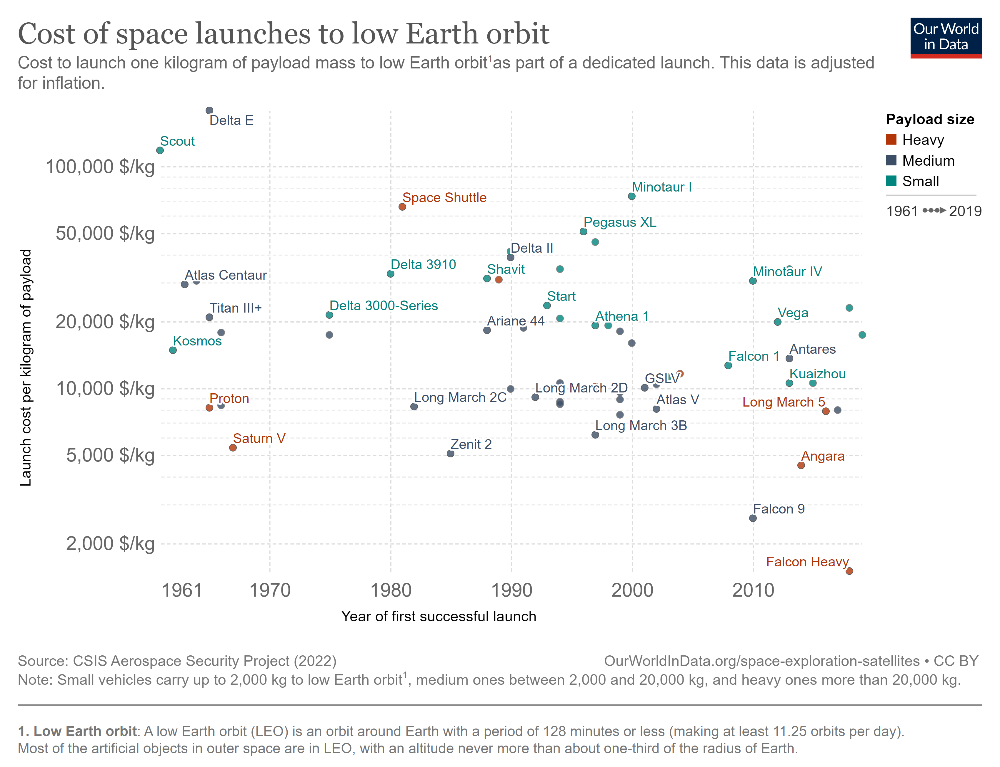

# IGI_3014 : Base de donnée Relationnelles
https://ourworldindata.org/space-exploration-satellites

php.myadmin
https://tp-bdd.esiee.fr/phpmyadmin/db_structure.php?db=IGI-3014-AUBERT 

### Projet de groupe :
* [bebe0106](https://github.com/bebe0106)
* 
* 

### Objectifs : 
Crée et exploiter une base de donnée relationnelle.

### Type de donnée : 
Les données sont en rapport avec l'espace. 
Les données sont au format `.csv`, dans le dossier : 'csv file'. La création des tables dans la base de donnée n'est pas
la même que les csv pour des changements evidents.

*(exemple de donnée)*

### Sources :
>@article{owidspaceexplorationsatellites,
    author = {Edouard Mathieu and Max Roser},
    title = {Space Exploration and Satellites},
    journal = {Our World in Data},
    year = {2022},
    note = {https://ourworldindata.org/space-exploration-satellites}
}
