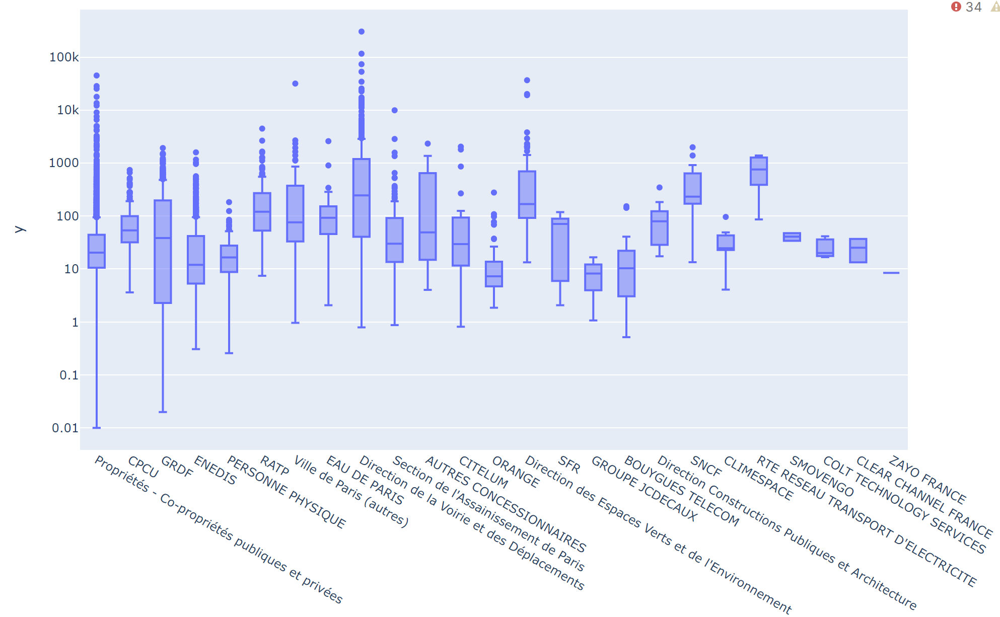
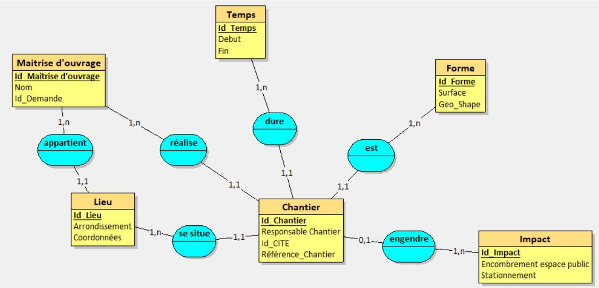

# IGI_3014 : Projet base de données

Réalisée en grouper avec :
- [@Benoit Marchadier](https://github.com/bebe0106)
- @Neo Jonas
- @Nicolas Charpentier
- @Réda Belghiti

***
#### Data set : 
Le [data set](https://opendata.paris.fr/explore/dataset/chantiers-a-paris/dataviz/?disjunctive.cp_arrondissement&disjunctive.chantier_categorie&disjunctive.moa_principal&disjunctive.chantier_synthese&disjunctive.localisation_detail&disjunctive.localisation_stationnement)
provient de la ville de paris. 
Il traite des chantiers à Paris sur l'année 2021.

## Résultats: 
Utilisation de plotly et de PhpMyAdmin. 

**'Surface' en fonction de 'Maitrise d'ouvrage'**

**Modèle_Entité_Association**
